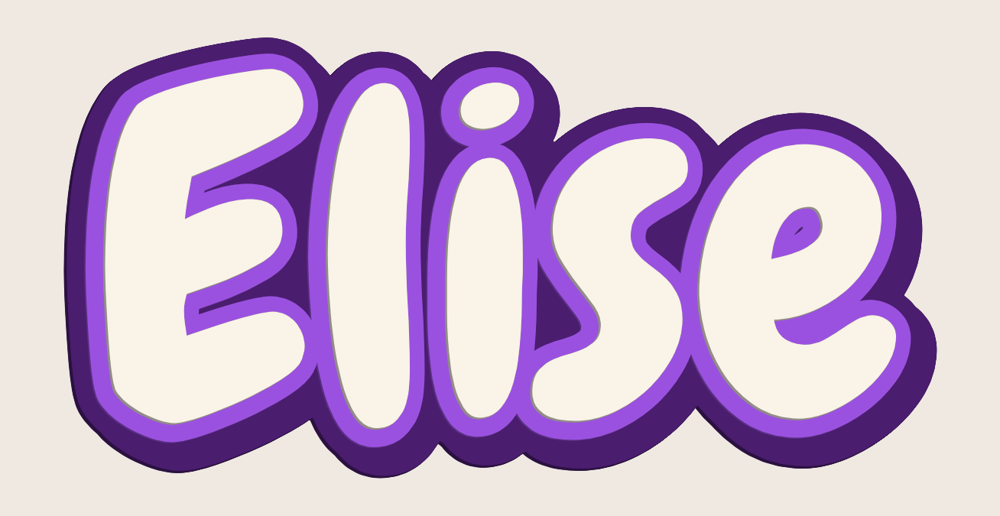
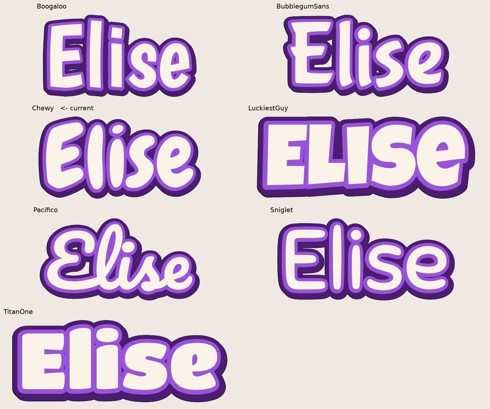

# "sonics" Cheer Charm

A multi-color 3D-printable charm of the **sonics** team logo — built as a
keychain, a bag charm, and a Croc/Jibbitz charm. Designed for a **Bambu Lab
H2D + AMS** (multi-color), but it prints fine in a single color too.

The logo is rebuilt from the uniform: **red blackletter text + white outline +
black background**, in an Old-English (Fraktur) font.


---

## TL;DR — what do I print?

| I want a…        | Folder              | Notes                                              |
|------------------|---------------------|----------------------------------------------------|
| **Keychain**     | `models/keychain/`  | 5 mm hole for a key ring / split ring              |
| **Bag charm**    | `models/bagcharm/`  | 8 mm hole for a lobster clasp                       |
| **Croc charm**   | `models/croc/`      | Snap-in rivet on the back (⚠ experimental — see below) |

Each folder contains the same set of files:

| File | What it is |
|------|------------|
| `*_plate.stl`   | The **black** background plate (+ loop / rivet) |
| `*_outline.stl` | The **white** outline around the letters |
| `*_text.stl`    | The **red** "sonics" lettering |
| `*_combined.stl`| All three fused into one — print this for a **single-color** charm |
| `*.step`        | Editable CAD file (for me, or any CAD program, to tweak later) |

The charm is **~56 mm wide** and the word is **50 mm** wide.

---

## How to print it in COLOR on your H2D + AMS

This is the magic of your printer. You'll load the three colored pieces as one
object and tell Bambu Studio which filament each piece uses.

1. **Load filament** into the AMS: **black**, **white**, and **red** (red =
   true cheer red; "Bambu Red" or similar is perfect).
2. Open **Bambu Studio** and select your **H2D** as the printer.
3. **File → Import → Import 3MF/STL…** and select **all three** files from a
   folder at once:
   `keychain_plate.stl`, `keychain_outline.stl`, `keychain_text.stl`.
4. Bambu Studio will ask **"Load these files as a single object?"** → click
   **Yes**. They're modeled at the same coordinates, so they snap together
   perfectly into one charm.
5. In the right-hand **Objects** list, expand the object to see the 3 parts.
   Right-click each part → **Change filament** (or click the little color dot)
   and set:
   - **`…_plate`  → Black**
   - **`…_outline` → White**
   - **`…_text`  → Red**
6. **Slice**, preview (scrub the layer slider to watch the colors appear), then
   **Print**.

> Single color instead? Just import the one `*_combined.stl` file and print
> normally — no AMS needed.

### Recommended print settings (good starting point)

| Setting | Value | Why |
|---|---|---|
| Material | **PLA** | Easiest, looks great, perfect for charms |
| Layer height | **0.12–0.16 mm** | Crisp small lettering |
| Walls / wall loops | **3** | Strong thin features |
| Infill | **15–20%** | It's tiny; this is plenty |
| Supports | **Off** (keychain & bag charm) | They're flat — no supports needed |
| Plate | Smooth PEI if you have it | Glossy back face |
| Orientation | **Flat, as loaded** | Already oriented correctly |

A charm this size prints in roughly **20–40 minutes** and uses only a few grams
of filament.

---

## ⚠ Croc charm notes (read before printing `models/croc/`)

Printable Croc/Jibbitz rivets are genuinely finicky — the exact fit depends on
your specific Crocs. This one is a solid first attempt and **may need a
test-fit and a tweak**:

- It's already **flipped rivet-up / face-down**, so it prints **without
  supports**. The smooth lettered front ends up against the build plate.
- Current rivet sizes (in `src/generate_sonics_charm.py`, `CROC = {...}`):
  neck Ø10 mm, neck height 3 mm, back flange Ø13 mm.
- **If it won't snap in:** the neck is too big — tell me and I'll shrink
  `neck_d`. **If it pops out:** the back flange is too small — I'll grow
  `back_d`. PLA is stiff; **PETG or a TPU rivet** snaps in more forgivingly.
- Easiest alternative: print the **keychain** charm (no loop hole version on
  request) and glue on a cheap stick-on Croc-charm back or a pin back.

Tell me your result and I'll dial it in.

---

## Want changes? It's fully parametric

Everything is generated by **`src/generate_sonics_charm.py`**. Just tell me what
you want and I'll regenerate — e.g.:

- "Make it bigger / smaller" (`TEXT_WIDTH`)
- "Thicker / thinner white outline" (`OUT_MARGIN`)
- "Bigger black border" (`PLATE_MARGIN`)
- "Make the letters pop out more" (`TEXT_RAISE`)
- "Different blackletter font" — I also have PirataOne and GermaniaOne in `fonts/`
- "Add a year / name / second line"

To regenerate yourself (if you ever want to):

```bash
pip install cadquery shapely matplotlib trimesh pillow scipy
python3 src/generate_sonics_charm.py   # charms + (run svg script for Cricut)
python3 src/generate_bow.py --name Eden # cheer bow (traced from assets/)
```

---

## Cheer bow charms (with names!)

A multi-color cheer bow that clips to a backpack — **white loops, red text,
black trim**, with a **red center knot** and a **fully-printed snap clip** on
top. Layout: gym name on the left loop, team + athlete name on the right.

The bow shape is **traced from a real bow image** (`assets/cheer_bow_source.png`)
by `src/trace_bow.py`, so it actually looks like a cheer bow. To use a different
bow, drop in a new black-on-white silhouette and re-run.


- Files: `models/bow_<name>/` (same structure as the charms: `_plate` = black,
  `_outline` = white, `_text` = red, plus `_combined.stl` and `.step`).
- Size: ~90 mm wide. Multi-color print exactly like the charms.

### Make one per girl — change the name in one command
```bash
python3 src/generate_bow.py --name Eden
python3 src/generate_bow.py --name Harper
python3 src/generate_bow.py --name Aubrey --team XOXO --gym Sonics
```
Each run creates a new `models/bow_<name>/` folder and a preview. Just send me
the roster and I'll batch out all 12 at once.

### ⚠ About the snap clip
It's a fully-printed carabiner-style clip — **experimental**, so expect to
test-print it and maybe tweak. Print in **PLA or (better) PETG** for a springier
gate. If the gate is too stiff or too loose, tell me and I'll adjust
`CLIP_GATE_W` / clearances. Print **flat** (as oriented) so the gate flexes along
the layer lines.

---

## Wall name plate ("Elise")

A big layered bubble-letter sign for a bedroom wall — deep purple back plate
with a drop shadow, a bright purple halo hugging the letters, and chunky cream
letters standing proud on top. **Keyhole hangers are built into the back**, so
it hangs on two screws with nothing showing from the front.



- Folder: **`models/nameplate_elise/`** (same file layout as the charms:
  `_plate` / `_outline` / `_text` / `_combined.stl` / `.step`)
- Size: **253 × 127 × 9 mm** (the word itself is 230 mm ≈ 9 in wide)
- Font: **Chewy** — the closest free match to the inspiration photo
- Fits the **H2D** bed in one piece. For a 256 mm bed (X1C / P1S / A1) rerun
  with `--width 200`.

### Printing it

The three colors are stacked as three clean height bands — plate `0–4 mm`, halo
`4–6 mm`, letters `6–9 mm` — which means the whole sign needs only **two
filament changes**, not one per layer. Purge waste stays around 20 g instead of
several hundred.

1. Load **deep purple**, **bright purple**, and **cream/white** into the AMS.
2. **File → Import → Import 3MF/STL…**, select all three
   `nameplate_elise_{plate,outline,text}.stl` at once → **"Load as a single
   object?" → Yes**. They're modeled on the same origin so they snap together.
3. Assign filaments per part: `_plate` → deep purple, `_outline` → bright
   purple, `_text` → cream.
4. Slice and print. Single color instead? Just import `_combined.stl`.

| Setting | Value | Why |
|---|---|---|
| Material | **PLA** | Cheap, stiff, great colors |
| Layer height | **0.2 mm** | It's big — no need to go finer |
| Walls | **3** | Plenty; the sign is mostly hollow |
| Infill | **10–15% gyroid** | Keeps it light on the wall |
| Supports | **Off** | Every layer sits on the one below it |
| Orientation | **Flat, as loaded** | Letters up, back on the plate |

Expect roughly **6–9 hours** and **~110–140 g** of filament.

### Hanging it

Two keyhole pockets are recessed into the back, **76 mm apart and level with
each other**. Put two screws (or drywall anchors) in the wall 76 mm apart, leave
the heads ~3 mm proud, hook the sign on through the round holes and slide it
down — the shank locks into the narrow slot. There's a 1.4 mm wall behind each
pocket, so nothing pokes through the front.

Prefer tape? Rerun with `--no-hangers` for a flat back and use Command strips.

### Want it different?

Everything is parametric — pick a different name, font, size, or palette:

```bash
python3 src/generate_nameplate.py --name Elise --font TitanOne
python3 src/generate_nameplate.py --name Elise --width 300 --colors teal
python3 src/generate_nameplate.py --name Elise --no-hangers
python3 src/render_nameplate_options.py --name Elise   # the two sheets below
```

Seven bubbly fonts and six palettes are built in — see
[`renders/nameplate_font_options.png`](renders/nameplate_font_options.png) and
[`renders/nameplate_color_options.png`](renders/nameplate_color_options.png).



The script always checks that the letters actually **fuse into one piece** (it
grows the plate margin automatically if they don't) and tells you which Bambu
beds the result fits on.

---

## Credits / license

- Font: **UnifrakturCook** by Peter Wiegel / GFOS, licensed under the
  **SIL Open Font License 1.1** (free for personal & commercial use). See
  `fonts/LICENSE.md`.
- Logo wordmark belongs to the sonics team — this is a fan/personal-use charm.
