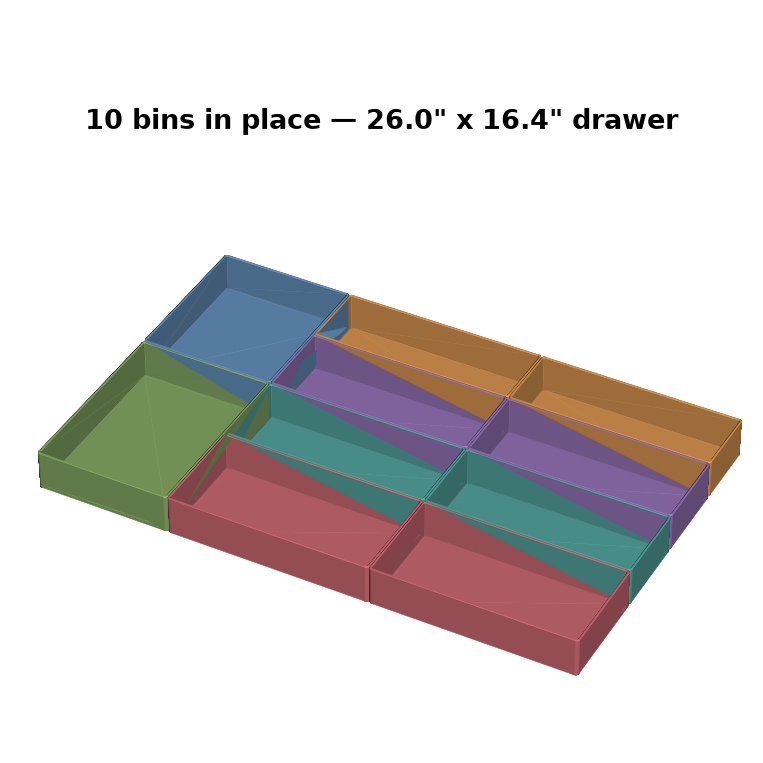

# "sonics" Cheer Charm

A multi-color 3D-printable charm of the **sonics** team logo — built as a
keychain, a bag charm, and a Croc/Jibbitz charm. Designed for a **Bambu Lab
H2D + AMS** (multi-color), but it prints fine in a single color too.

The logo is rebuilt from the uniform: **red blackletter text + white outline +
black background**, in an Old-English (Fraktur) font.


---

## TL;DR — what do I print?

| I want a…        | Folder              | Notes                                              |
|------------------|---------------------|----------------------------------------------------|
| **Keychain**     | `models/keychain/`  | 5 mm hole for a key ring / split ring              |
| **Bag charm**    | `models/bagcharm/`  | 8 mm hole for a lobster clasp                       |
| **Croc charm**   | `models/croc/`      | Snap-in rivet on the back (⚠ experimental — see below) |

Each folder contains the same set of files:

| File | What it is |
|------|------------|
| `*_plate.stl`   | The **black** background plate (+ loop / rivet) |
| `*_outline.stl` | The **white** outline around the letters |
| `*_text.stl`    | The **red** "sonics" lettering |
| `*_combined.stl`| All three fused into one — print this for a **single-color** charm |
| `*.step`        | Editable CAD file (for me, or any CAD program, to tweak later) |

The charm is **~56 mm wide** and the word is **50 mm** wide.

---

## How to print it in COLOR on your H2D + AMS

This is the magic of your printer. You'll load the three colored pieces as one
object and tell Bambu Studio which filament each piece uses.

1. **Load filament** into the AMS: **black**, **white**, and **red** (red =
   true cheer red; "Bambu Red" or similar is perfect).
2. Open **Bambu Studio** and select your **H2D** as the printer.
3. **File → Import → Import 3MF/STL…** and select **all three** files from a
   folder at once:
   `keychain_plate.stl`, `keychain_outline.stl`, `keychain_text.stl`.
4. Bambu Studio will ask **"Load these files as a single object?"** → click
   **Yes**. They're modeled at the same coordinates, so they snap together
   perfectly into one charm.
5. In the right-hand **Objects** list, expand the object to see the 3 parts.
   Right-click each part → **Change filament** (or click the little color dot)
   and set:
   - **`…_plate`  → Black**
   - **`…_outline` → White**
   - **`…_text`  → Red**
6. **Slice**, preview (scrub the layer slider to watch the colors appear), then
   **Print**.

> Single color instead? Just import the one `*_combined.stl` file and print
> normally — no AMS needed.

### Recommended print settings (good starting point)

| Setting | Value | Why |
|---|---|---|
| Material | **PLA** | Easiest, looks great, perfect for charms |
| Layer height | **0.12–0.16 mm** | Crisp small lettering |
| Walls / wall loops | **3** | Strong thin features |
| Infill | **15–20%** | It's tiny; this is plenty |
| Supports | **Off** (keychain & bag charm) | They're flat — no supports needed |
| Plate | Smooth PEI if you have it | Glossy back face |
| Orientation | **Flat, as loaded** | Already oriented correctly |

A charm this size prints in roughly **20–40 minutes** and uses only a few grams
of filament.

---

## ⚠ Croc charm notes (read before printing `models/croc/`)

Printable Croc/Jibbitz rivets are genuinely finicky — the exact fit depends on
your specific Crocs. This one is a solid first attempt and **may need a
test-fit and a tweak**:

- It's already **flipped rivet-up / face-down**, so it prints **without
  supports**. The smooth lettered front ends up against the build plate.
- Current rivet sizes (in `src/generate_sonics_charm.py`, `CROC = {...}`):
  neck Ø10 mm, neck height 3 mm, back flange Ø13 mm.
- **If it won't snap in:** the neck is too big — tell me and I'll shrink
  `neck_d`. **If it pops out:** the back flange is too small — I'll grow
  `back_d`. PLA is stiff; **PETG or a TPU rivet** snaps in more forgivingly.
- Easiest alternative: print the **keychain** charm (no loop hole version on
  request) and glue on a cheap stick-on Croc-charm back or a pin back.

Tell me your result and I'll dial it in.

---

## Want changes? It's fully parametric

Everything is generated by **`src/generate_sonics_charm.py`**. Just tell me what
you want and I'll regenerate — e.g.:

- "Make it bigger / smaller" (`TEXT_WIDTH`)
- "Thicker / thinner white outline" (`OUT_MARGIN`)
- "Bigger black border" (`PLATE_MARGIN`)
- "Make the letters pop out more" (`TEXT_RAISE`)
- "Different blackletter font" — I also have PirataOne and GermaniaOne in `fonts/`
- "Add a year / name / second line"

To regenerate yourself (if you ever want to):

```bash
pip install cadquery shapely matplotlib trimesh pillow scipy
python3 src/generate_sonics_charm.py   # charms + (run svg script for Cricut)
python3 src/generate_bow.py --name Eden # cheer bow (traced from assets/)
```

---

## Cheer bow charms (with names!)

A multi-color cheer bow that clips to a backpack — **white loops, red text,
black trim**, with a **red center knot** and a **fully-printed snap clip** on
top. Layout: gym name on the left loop, team + athlete name on the right.

The bow shape is **traced from a real bow image** (`assets/cheer_bow_source.png`)
by `src/trace_bow.py`, so it actually looks like a cheer bow. To use a different
bow, drop in a new black-on-white silhouette and re-run.


- Files: `models/bow_<name>/` (same structure as the charms: `_plate` = black,
  `_outline` = white, `_text` = red, plus `_combined.stl` and `.step`).
- Size: ~90 mm wide. Multi-color print exactly like the charms.

### Make one per girl — change the name in one command
```bash
python3 src/generate_bow.py --name Eden
python3 src/generate_bow.py --name Harper
python3 src/generate_bow.py --name Aubrey --team XOXO --gym Sonics
```
Each run creates a new `models/bow_<name>/` folder and a preview. Just send me
the roster and I'll batch out all 12 at once.

### ⚠ About the snap clip
It's a fully-printed carabiner-style clip — **experimental**, so expect to
test-print it and maybe tweak. Print in **PLA or (better) PETG** for a springier
gate. If the gate is too stiff or too loose, tell me and I'll adjust
`CLIP_GATE_W` / clearances. Print **flat** (as oriented) so the gate flexes along
the layer lines.

---

## Drawer organizer bins (26" x 16.4" x 2" deep)

Open-top bins that tile the drawer from the sketch: a narrow left column split
in two, and a wide right column split into four.




**Files:** `models/drawer_boxes/` — one `bin_<id>.stl` + `.step` per bin,
`drawer_assembly.step` (everything positioned in the drawer), and
[`PRINT_LIST.md`](models/drawer_boxes/PRINT_LIST.md) with every size and a
filament estimate.

### The catch: the long compartments don't fit on the plate

Compartments **C3–C6 are 19.5" long** (495 mm). No printer takes that — the H2D
plate is 350 x 320 mm. So each of those is **two identical 9.75" bins that sit
end to end** in the drawer. Butted together they read as one long compartment,
and they're easier to lift out and empty than one huge tray would be.

That's **10 bins total**, about **1.3 kg of filament** — call it 3 spools with
waste, and a couple of days of printing. Worth knowing before you start.

| Print | Bin | Size | Qty |
|---|---|---|---|
| C1 | `bin_C1.stl` | 6.5" x 7.4" | 1 |
| C2 | `bin_C2.stl` | 6.5" x 9.0" | 1 |
| C3 | `bin_C3-1.stl` | 9.75" x 3.4" | 2 |
| C4 | `bin_C4-1.stl` | 9.75" x 4.0" | 2 |
| C5 | `bin_C5-1.stl` | 9.75" x 4.0" | 2 |
| C6 | `bin_C6-1.stl` | 9.75" x 5.0" | 2 |

The `-1` and `-2` files of a pair are identical, so just print the `-1` twice.

### Print settings

| Setting | Value | Why |
|---|---|---|
| Material | **PLA** (PETG if the drawer gets hot) | Cheap and stiff enough |
| Layer height | **0.20–0.28 mm** | These are big and plain — go fast |
| Walls | **3** | Walls are 2 mm, so 3 loops fills them solid |
| Infill | **10%** | Barely any — it's nearly all wall and floor |
| Supports | **Off** | Flat-bottomed open boxes |
| Orientation | **As loaded** (open side up) | No supports, clean rim |

Bins are **48 mm tall** (2" minus clearance) and sized **0.8 mm under** their
slot, so the whole set drops in without fighting the drawer.

### Measure before you print

The sizes come straight off the sketch, and two things are worth checking with a
tape measure first:

- **16.4" front-to-back** — if that was meant to be 16¼", say so and I'll rerun.
- **The divider positions.** The sketch isn't to scale, so I read the splits off
  the proportions: left column 6.5" wide, rows 3.4" / 4.0" / 4.0" / 5.0" front
  to back. Tell me the real numbers, or what's going in each bin, and I'll
  redraw the layout.

Everything is parametric in `src/generate_drawer_boxes.py` — the `DRAWER_*` and
`LAYOUT` blocks at the top are the whole design:

```bash
pip install cadquery matplotlib trimesh
python3 src/generate_drawer_boxes.py
```

Change a number, re-run, and it re-splits the compartments to fit the plate,
re-exports every bin, and redraws both pictures.

---

## Credits / license

- Font: **UnifrakturCook** by Peter Wiegel / GFOS, licensed under the
  **SIL Open Font License 1.1** (free for personal & commercial use). See
  `fonts/LICENSE.md`.
- Logo wordmark belongs to the sonics team — this is a fan/personal-use charm.
