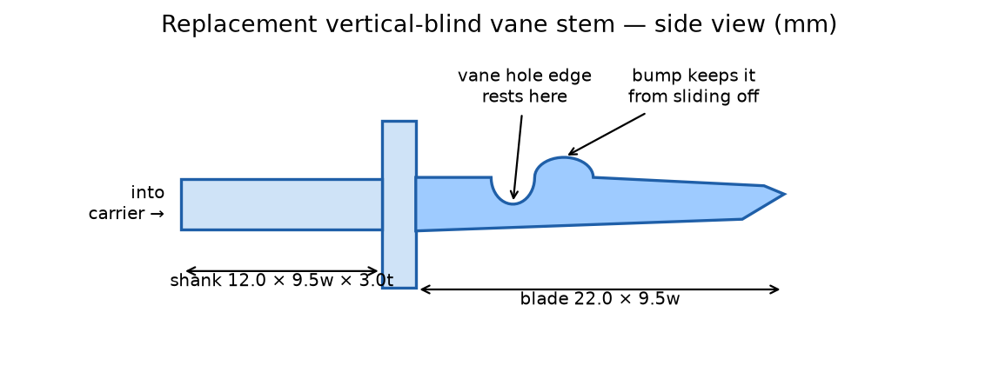

# Vertical Blind Vane Stem (replacement clip)

The part that broke is called a **vane stem** (also sold as a "vertical blind
stem", "vane hanger", or "carrier clip"). It's the little clear plastic hook
that sticks out of each **carrier** (the white geared trolley inside the
headrail) — the vane (slat) hangs from it, and the hook end is famous for
snapping off.

This folder has a 3D-printable replacement.

## Files

| File | What it is |
|------|------------|
| `blind_stem.stl`          | The replacement stem. Duplicate it in the slicer and print a few spares. |
| `blind_stem_fit_test.stl` | Three short shank-only test pieces — **print this first** (see below). |
| `blind_stem.step`         | Editable CAD file. |

## Before you print — 2 quick checks

Stems are NOT standardized between brands, so:

1. **Get the broken stub out of the carrier.** Grab it with needle-nose
   pliers and pull straight out (wiggle gently). Some snap in — a firm pull
   frees them.
2. **Measure** (calipers if you have them, a ruler works):
   - the stub's **shank**: width, thickness, and how deep it sat in the
     socket — or measure the socket opening itself;
   - the punched **hole in the vane** (standard is ~14 × 6 mm).

   Defaults in the design: shank **9.5 wide × 3.0 thick × 12 deep**, blade
   9.5 wide. If yours differ, edit the CONFIG block in
   `src/generate_blind_stem.py` and re-run it
   (`python3 src/generate_blind_stem.py`).

## Print the fit test first

`blind_stem_fit_test.stl` has three stubby shanks: **1 notch = small,
2 = medium (default), 3 = large** (±0.3 mm wide / ±0.2 mm thick). Push each
into the empty carrier socket. Whichever fits snug is your size — if it's not
the 2-notch one, adjust `SHANK_W` / `SHANK_T` in the script by that offset
and regenerate.

## Print settings (Bambu Studio)

- **Filament: PETG** if you have it (a bit flexible, won't snap like the
  original). PLA works but is more brittle.
- **Orientation: lay it flat on its side** (the slicer's auto-orient usually
  gets this right — the blade profile should be face-down). This puts the
  layer lines along the hook so the hanging vane can't split them apart.
- 100% infill or 5+ walls (the part is tiny — seconds of print time).
- Layer height 0.12–0.16 mm for a cleaner notch.

## Putting it back together

1. Push the new stem into the carrier socket until the collar seats (the
   barb on top clicks it in place).
2. Hold the vane up to the stem, slide the punched hole over the tip of the
   blade, and pull it toward the headrail — it rides over the bump and drops
   into the notch. Done.

## Don't want to print one?

Search for **"vertical blind repair stems"** or **"vane savers"** — a bag of
10 is a few dollars. Match the style to your carrier (take the broken stub
to compare, or a photo). "Vane savers" fix the *other* common failure (torn
hole in the vane itself).
