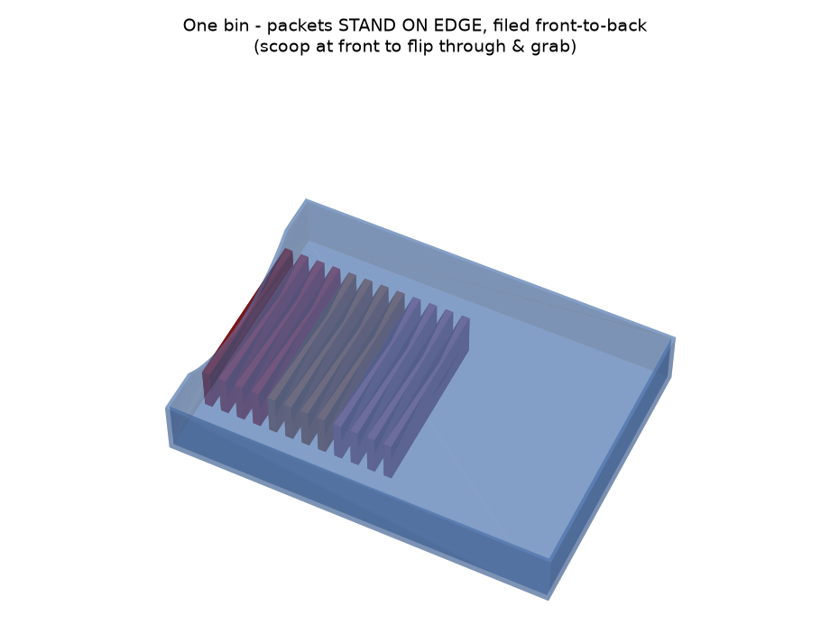

# Drink-packet drawer organizer (file on edge)

Open-top bins for a **20 × 14.5 × ~2.4 in** drawer. Drink-mix packets
(ICEE, Holloway, Laura Beverlin, etc.) **stand on edge and file front-to-back
like folders** — you flip through them and pull one out. A curved **scoop** in
the front wall gives finger access.

No baseplate, no Gridfinity — **just bins**.

## Layout

**2 long trays running the length of the drawer, side by side.** A full 20 in
tray won't fit the H2D bed (~350 mm), so each tray is **2 pieces** → a **2 × 2
grid of 4 identical bins** that fills the whole drawer.

- Each bin: **9.9 × 7.2 × 1.6 in** (252 × 182 × 40 mm)
- Packets stand ~1.25 in tall and file along the 10 in length — **plenty of
  room**, way more than you'll fill
- Scoop faces the front of the drawer so you flip through and grab

## What to print

| File | What | Print how many |
|------|------|----------------|
| `drink_stick_box.stl` | One bin, scooped front | **4×** (all identical) |
| `drawer_layout_preview.stl` | All 4 placed in the drawer | **don't print** — just to eyeball it |

## Print settings (Bambu H2D, one color)

| Setting | Value |
|---|---|
| Material | PLA (or PETG) |
| Layer height | 0.2–0.28 mm |
| Walls | 3 |
| Infill | 10–15% |
| Supports | **None** (scoop is a gentle arc) |
| Orientation | As-is, open side up |
| Per plate | 1 bin per H2D plate (they're ~10 in long) |

## Want it different? It's parametric

Edit the CONFIG block in `src/generate_drawer_organizer.py` and re-run
`python3 src/generate_drawer_organizer.py`:

- **More divisions down the length:** `COLS` (e.g. 4 → shorter bins).
- **More trays across the width:** `ROWS`.
- **Taller / shorter bins:** `BOX_H`.
- **Different packet or drawer:** `PKT_*`, `DRAWER_*`.
