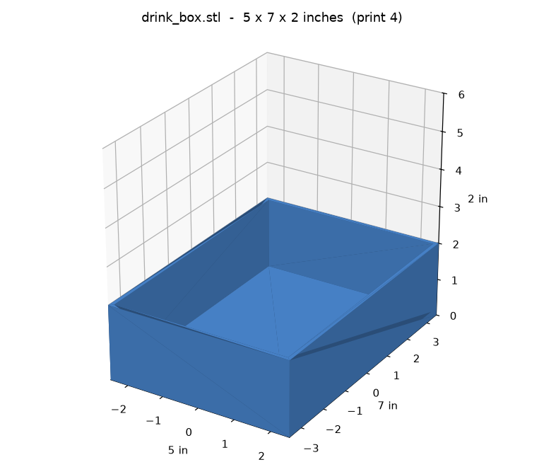
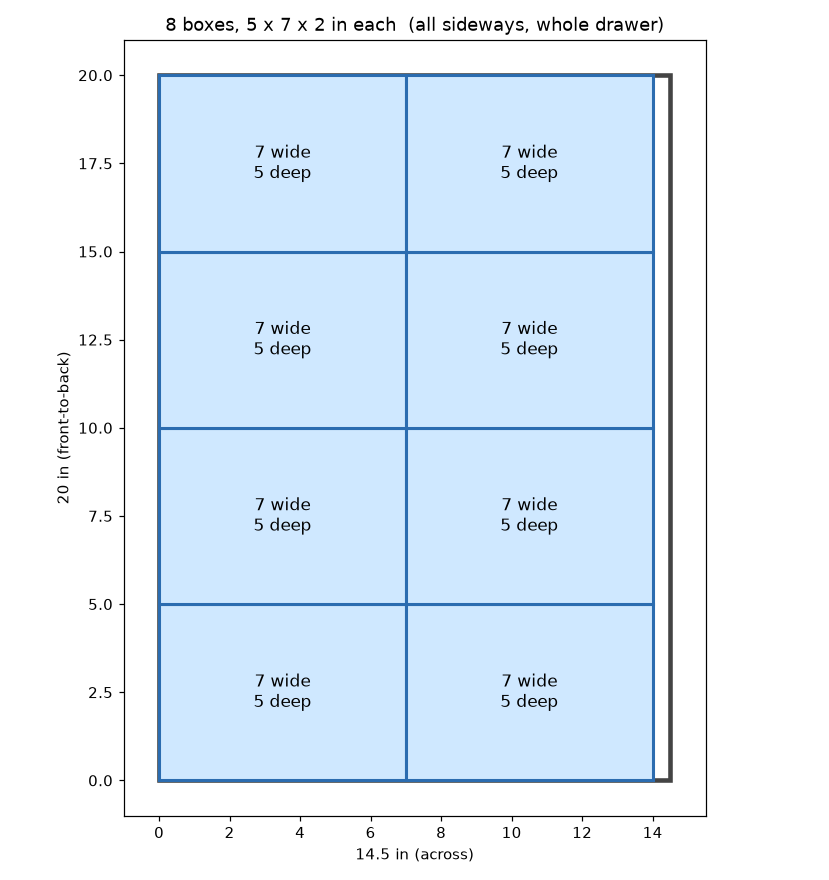

# Drawer boxes — 5 × 7 × 2 in

Plain open boxes for a **20 × 14.5 in** drawer. Each box is **5 × 7 × 2 inches**.
Turned sideways they're **7 in across × 5 in deep**, so **2 across** (14 in) × **4 deep** (20 in) = **8 boxes** fill the whole drawer.

## What to print

| File | What | How many |
|------|------|----------|
| `drink_box.stl` | One box, 5 × 7 × 2 in | 8 |
| `drawer_layout_preview.stl` | boxes in the drawer | don't print — just to look |

## Print settings (Bambu H2D)

- PLA, 0.2–0.28 mm layers, 3 walls, 10–15% infill
- No supports, open-side-up, one box per plate

## Change it

Edit the inch values at the top of `src/generate_drawer_organizer.py`
(`BOX_ACROSS_IN`, `BOX_DEEP_IN`, `BOX_H_IN`, `N_ACROSS`, `N_DEEP`) and re-run it.
